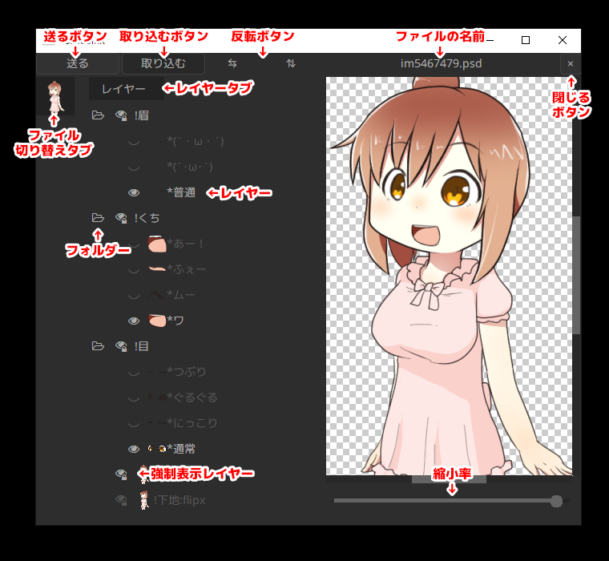

# PSD ファイルオブジェクト

PSD ファイルを読み込んだ際に生成されるオブジェクトを `PSD ファイルオブジェクト` と呼びます。  
その実態はスクリプトが記述された `テキスト` オブジェクトに [`描画@PSD`](psd.md#描画@PSD) が追加されたものです。

テキストの見た目を変更するプロパティ（フォント名やサイズや文字揃えなど）は変更しないでください。

テキスト入力欄には以下のオプション設定があり、必要に応じて書き換えて使用します。

設定名|説明
---|---
`lipsync`|[`口パク準備`](prep.md#口パク準備@PSDToolKit) があるレイヤー番号を半角整数で指定します。 これを指定すると `口パク準備` の設置区間に合わせて [subobj アニメーション効果](subobj.md) が使えます。 （ただし `口パク準備（音素のみ）` では使えません）
`mpslider`|[`多目的スライダー`](prep.md#多目的スライダー@PSDToolKit)があるレイヤー番号を半角整数で指定します。 これを指定すると `多目的スライダー` の設置区間に合わせて [subobj アニメーション効果](subobj.md) が使えます。 `lipsync` と `mpslider` が同時に指定されている場合は `多目的スライダー` の区間が使用されます。
`scene`|シーン上でオブジェクトを使うときに、他のシーンと被らない番号を指定します。 変更しなくても問題なく動作しますが、一定の条件が揃った場合に描画負荷が極端に高くなることがあります。
`tag`|PSDToolKit ウィンドウに表示されている PSD ファイルのうち、どれに関連付けられているのかを示すタグです。 `0` 以外の値を指定してあると、対応する PSD ファイルが PSDToolKit ウィンドウになくても自動的に追加されます。
`ls_locut`|`口パク準備` で `ローカット` を `0` にしている場合、ここで指定した値が使用されます。
`ls_hicut`|`口パク準備` で `ハイカット` を `0` にしている場合、ここで指定した値が使用されます。
`ls_threshold`|`口パク準備` で `しきい値` を `0` にしている場合、ここで指定した値が使用されます。
`ls_sensitivity`|`口パク準備` で `感度` を `0` にしている場合、ここで指定した値が使用されます。

## PSDToolKit ウィンドウ

`PSDToolKit ウィンドウ` は [`PSD ファイルオブジェクト`](#PSD_ファイルオブジェクト) のレイヤーの表示を切り替えたり、レイヤー名をコピーしたりするために使用するウィンドウです。

AviUtl のメインメニューから `編集`→`PSDToolKit`→`ウィンドウを表示` で表示できます。

機能名|説明
---|---
`送る` ボタン|現在の表示構成を拡張編集に送信します。 ただし `PSD ファイルオブジェクト` のテキスト入力欄が見えていないと送れません。 `Ctrl + S` のショートカットキーで押すこともできます。
`⇆`（左右反転）ボタン|画像を左右反転します。 もし PSD ファイル側で [PSDTool の反転レイヤー指定機能](https://oov.github.io/psdtool/manual.html#original-feature-flip)が使われている場合はレイヤーも自動で切り替わり、文字の反転やアクセサリーの左右逆、着物の左前などの問題が自動で解消されます。
`⇅`（上下反転）ボタン|画像を上下反転します。 もし PSD ファイル側で [PSDTool の反転レイヤー指定機能](https://oov.github.io/psdtool/manual.html#original-feature-flip)が使われている場合はレイヤーも自動で切り替わります。
ファイルの名前|現在編集中の PSD ファイルの名前です。
`×`（閉じる）ボタン|編集中の PSD ファイルを閉じます。 閉じてもこのウィンドウから見えなくなるだけで、拡張編集では引き続き表示されます。 閉じたファイルを復活させる方法はありませんが、同じ PSD ファイルをこのウィンドウに直接ドラッグ＆ドロップすることで再度表示できます。
ファイル切り替えタブ|複数の PSD ファイルを読み込んでいる時は、ここに表示されるサムネイルをクリックすることで切り替えできます。
`レイヤー` タブ|[PSDTool](https://oov.github.io/psdtool/) で作成したお気に入りを一緒に読み込んでいる時は `レイヤー` の他に `お気に入り` や `シンプルV` タブが現れます。
レイヤー|`クリック` で表示／非表示を切り替えできます。 レイヤー名が `*` で始まる [PSDTool のラジオボタン化機能](https://oov.github.io/psdtool/manual.html#original-feature-asterisk)を利用したレイヤーは、グループ内で常にひとつだけ表示された状態になります。 `Ctrl + クリック` すると同じ階層の中でクリックしたレイヤーのみを表示します。 `右クリック` すると、レイヤーの名前をクリップボードにコピーしたりできるメニューが表示されます。
フォルダー|クリックで開閉できます。
強制表示レイヤー|右下に鍵マークがついているのは PSD ファイル側で [PSDTool の強制表示化機能](https://oov.github.io/psdtool/manual.html#original-feature-exclamation)を使っているレイヤーです。 非表示にするとおかしな表示状態になることが予めわかっているレイヤーに設定されています。
縮小率|PSDToolKit ウィンドウ内での縮小率の設定です。 ここでの縮小率は拡張編集側には反映されません。

また、このウィンドウにファイルをドラッグ＆ドロップするとファイル切り替えタブにファイルを追加することができます。

# 字幕表示

`字幕表示` は [`字幕準備`](prep.md#字幕準備) で用意されたテキストを画面に表示するためのオブジェクトです。  
その実態はスクリプトが記述された `テキスト` オブジェクトです。

`字幕表示` は拡張編集の右クリックメニューから `メディアオブジェクトの追加`→`PSDToolKit`→`字幕表示` で作成できます。

`字幕表示` では `字幕準備` の設置区間に合わせて [subobj アニメーション効果](subobj.md) が使用可能です。

テキスト入力欄には以下の設定があります。

設定名|説明
---|---
`layer`|[`字幕準備`](prep.md#字幕準備)があるレイヤー番号を半角整数で指定します。
